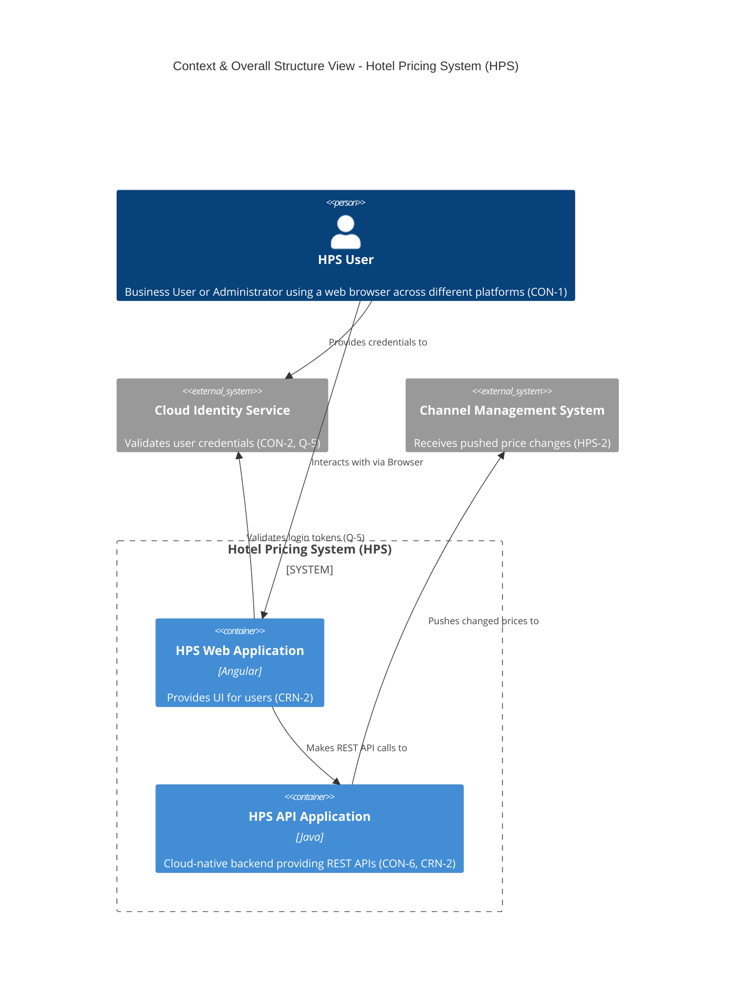
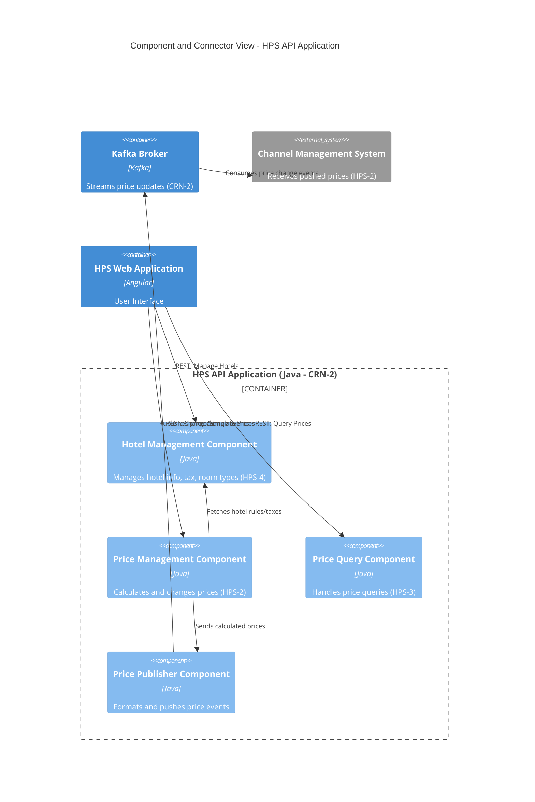
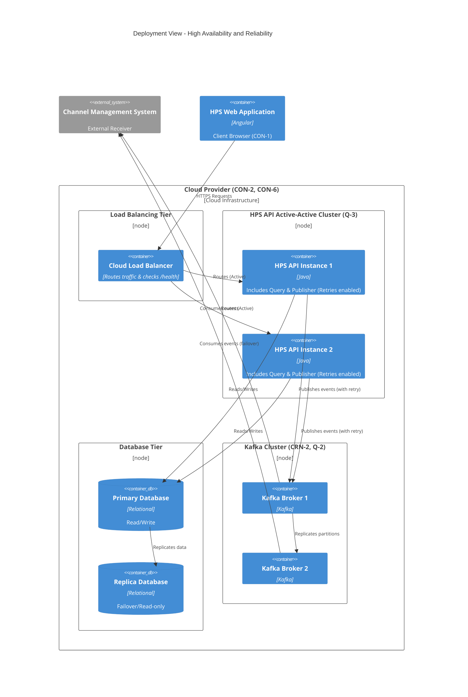
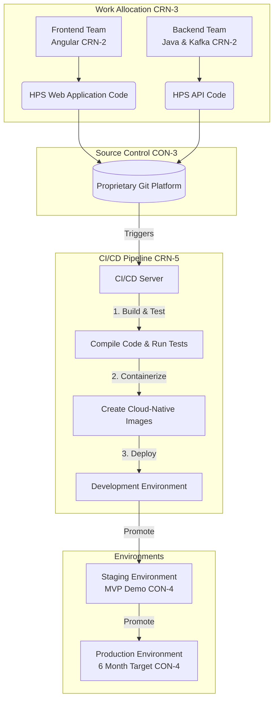

# Software Architecture — Assignment 2: Attribute Driven Design (ADD)

## Hotel Price System (HPS) — Architecture Design Report

| **Course** | Software Architecture |
|---|---|
| **Assignment** | Assignment 2 - Attribute Driven Design |
| **Approach** | Direct LLM interaction |
| **LLM Used** | gemini-3.1-pro-preview |
| **Team Members** | 韩乐妍, 陈奕谷, 成馨 |
| **Date** | 2026-06-11 |

---

## ADD Step 1: Review Inputs (Global)

This is a **greenfield** system in a **mature domain** (hotel price management), replacing an existing legacy system.

### Use Cases (6)

| ID | Name | Description |
|----|------|-------------|
| HPS-1 | Manage Hotel Information | CRUD operations for hotel information |
| HPS-2 | Change Prices | Modify prices (batch or individual) |
| HPS-3 | Query Prices | Query prices by hotel, date, and other criteria |
| HPS-4 | Manage Hotels | CRUD operations for hotel management |
| HPS-5 | Synchronize with External CMS | Data synchronization with external CMS |
| HPS-6 | User Login & Authentication | User authentication and access control |

### Quality Attributes (9)

| ID | Attribute | Scenario | Use Case | Importance |
|----|-----------|----------|----------|------------|
| QA-1 | Performance | Price query response < 100ms (95th percentile) | HPS-3 | High |
| QA-2 | Reliability | 100% price change publication success (max 3 retries) | HPS-2 | High |
| QA-3 | Availability | Query service uptime >= 99.9% | HPS-3 | High |
| QA-4 | Security | Only authenticated users can modify prices | HPS-2, HPS-6 | High |
| QA-5 | Modifiability | New pricing strategy affects < 5 files | HPS-2 | Medium |
| QA-6 | Testability | Price logic testable without DB dependency | HPS-2 | Medium |
| QA-7 | Scalability | Support 10x concurrent query growth | HPS-3 | Medium |
| QA-8 | Interoperability | Compatible with external CMS data formats | HPS-5 | Medium |
| QA-9 | Deployability | Zero-downtime deployments | HPS-3 | Low |

### Architectural Concerns (5)

| ID | Concern |
|----|---------|
| CRN-1 | Multi-channel distribution (Web, Mobile, API) |
| CRN-2 | Team familiar with Java/Angular/Kafka |
| CRN-3 | Parallel team work allocation |
| CRN-4 | Audit logging |
| CRN-5 | Continuous deployment infrastructure |

### Constraints (6)

| ID | Constraint |
|----|------------|
| CON-1 | Cloud deployment |
| CON-2 | Relational database (PostgreSQL) |
| CON-3 | Git platform for version control |
| CON-4 | 6-month delivery, MVP in 2 months |
| CON-5 | External CMS integration |
| CON-6 | Angular frontend |

---

## Iteration 1: Establishing Overall System Structure

*Generated by: 陈奕谷 (Member A)*
*Timestamp: 2026-06-11 08:43:53*

### Step 2: Iteration Goal and Driver Selection

**Iteration Goal:** Establish the overall initial system structure.

**Selected Drivers:**
- **CRN-1:** Establish the overall initial system structure.
- **CRN-2:** Leverage the team's knowledge of Java technologies, Angular framework, and Kafka.
- **CON-1:** Users must interact with the system through web browsers on different platforms.
- **CON-2:** Users are managed through a cloud provider identity service, resources hosted in cloud.
- **CON-6:** The system should be designed with a cloud-native approach as a priority.
- **Q-5 (Security):** User credentials validated through cloud identity service.

**Reasoning:** To establish the initial overall system structure (CRN-1), drivers dictating macroscopic shape, deployment environment, and fundamental interaction points are selected. CON-1, CON-2, CON-6 dictate a cloud-hosted, web-based, cloud-native architecture. CRN-2 constrains technology choices.

### Step 3: Element Selection

**Element Selected:** The Hotel Pricing System (HPS) itself.

**Justification:** Per ADD 3.0 for greenfield development, the only available element to refine at this stage is the system context itself—the entire HPS.

### Step 4: Design Concept Selection

**Alternative 1: Monolithic Web Application**
- *Pros:* Simpler to develop and deploy initially, supports 2-month MVP (CON-4).
- *Cons:* Does not align with cloud-native priority (CON-6), harder to scale (Q-4).

**Alternative 2: Cloud-Native Web Application (SPA + API Backend)**
- *Pros:* Aligns with cloud-native approach (CON-6) and cloud hosting (CON-2). Supports Angular frontend (CRN-2) and Java backend (CRN-2). SPA satisfies cross-platform browser requirement (CON-1). Integrates with cloud identity service (Q-5, CON-2).
- *Cons:* Slightly higher initial deployment complexity.

**Selection:** Alternative 2 (Cloud-Native Web Application).
**Rationale:** CON-6 prioritizes cloud-native approach. Splitting frontend/backend leverages Angular (CRN-2) and satisfies cross-platform constraint (CON-1), while cloud hosting integrates with identity service (CON-2, Q-5).

### Step 5: Architectural Elements Instantiation

| Element Name | Responsibility | Properties |
|---|---|---|
| **HPS Web Application** | Provides UI for users to log in, manage hotels/prices, query/change prices (CON-1) | SPA (Angular - CRN-2), Stateless, runs in browser |
| **HPS API Application** | Exposes REST APIs for Web App and external systems. Core business logic for pricing and hotel management | Cloud-native backend (Java - CRN-2), Stateless, hosted in cloud (CON-2) |
| **Cloud Identity Service** | External service managing users and validating credentials during login (Q-5, CON-2) | External Cloud Service |
| **Channel Management System** | External system receiving pushed price changes (HPS-2) | External System |

**Interfaces:**
- Browser ↔ HPS Web App: HTTP/HTTPS
- HPS Web App ↔ Cloud Identity Service: OAuth/OIDC for login validation
- HPS Web App ↔ HPS API App: REST API over HTTPS (JSON)
- HPS API App ↔ Channel Management System: Network push to external endpoints

### Step 6: Module View (Mermaid)

### Step 7: Analysis and Goal Review

- **CRN-1 (Establish overall structure):** Addressed. Context and primary components established.
- **CRN-2 (Leverage Angular/Java):** Addressed. Web App uses Angular, API uses Java.
- **CON-1 (Browser on multiple platforms):** Addressed. Angular SPA runs in standard browsers.
- **CON-2 & Q-5 (Cloud identity):** Addressed. Cloud Identity Service included.
- **CON-6 (Cloud-native):** Addressed. System split into independent scalable containers.

**Conclusion:** The iteration goal of establishing the overall initial system structure has been successfully achieved. The design is ready for further refinement in the next iteration.

---

## Iteration 2: Identifying Structures for Primary Functionality

*Generated by: 韩乐妍 (Member B)*
*Timestamp: 2026-06-11 09:03:45*

### Step 2: Iteration Goal and Driver Selection

**Iteration Goal:** Identifying Structures to Support Primary Functionality.

**Selected Drivers:**
- **HPS-2 (Change Price):** A user changes the base price or fixed price, calculations performed, prices pushed to channel management system.
- **HPS-3 (Query Price):** A user or external system queries the price of a specified hotel.
- **HPS-4 (Manage Hotels):** An administrator adds, changes, or modifies hotel information, tax rates, and room types.

**Reasoning:** The overall system structure was established in the previous iteration. To realize core business value, we must now define internal components that support these specific primary use cases.

### Step 3: Element Selection

**Element Selected:** HPS API Application.

**Justification:** According to the previous iteration, the HPS API Application is the central backend element responsible for business logic. It must be refined into smaller architectural elements to handle responsibilities of managing hotels (HPS-4), calculating/changing prices (HPS-2), and serving price queries (HPS-3).

### Step 4: Design Concept Selection

**Design Concept 1: Component-Based Layered Architecture** — Organize the HPS API Application into distinct functional components mapped to primary use cases.

**Design Concept 2: Message Broker for Asynchronous Push (HPS-2)** — When prices change, they must be pushed to the external Channel Management System.
- *Alternative A: RabbitMQ* — Not aligned with team's prior knowledge.
- *Alternative B: Kafka* — High-throughput distributed event streaming platform.
- **Selection: Alternative B (Kafka).**
- **Rationale:** Per CRN-2 ("Leverage team's knowledge of Java, Angular, Kafka"), choosing Kafka directly leverages the team's existing expertise. It also provides infrastructure to reliably push messages to the Channel Management System per HPS-2.

### Step 5: Architectural Elements Instantiation

| Element Name | Responsibility | Properties |
|---|---|---|
| **Hotel Management Component** | Handles adding/modifying hotel information, tax rates, room types (HPS-4) | Java-based (CRN-2), exposes REST APIs |
| **Price Management Component** | Handles changing base/fixed prices, calculating related prices, simulating price changes (HPS-2) | Java-based (CRN-2), interacts with Hotel Management for tax/room data |
| **Price Query Component** | Exposes endpoints for users/external systems to query hotel prices (HPS-3) | Java-based (CRN-2), optimized for read operations |
| **Price Publisher Component** | Receives calculated prices from Price Management and pushes them to Kafka | Java-based (CRN-2) |
| **Kafka Broker** | Receives price change events and makes them available for external systems (HPS-2, CRN-2) | Message Broker |

**Interfaces:**
- HPS Web App ↔ HPS API Components: REST APIs over HTTP/HTTPS (JSON) (CON-5)
- Price Publisher ↔ Kafka Broker: Kafka producer protocol
- Kafka Broker ↔ Channel Management System: Kafka consumer protocol (Push per HPS-2)

### Step 6: C&C View (Mermaid)

### Step 7: Analysis and Goal Review

- **HPS-2 (Change Price):** Addressed. Price Management Component handles base price change, calculates related prices, passes to Price Publisher → Kafka → Channel Management System.
- **HPS-3 (Query Price):** Addressed. Price Query Component provides dedicated interface for queries.
- **HPS-4 (Manage Hotels):** Addressed. Hotel Management Component explicitly instantiated for administrator actions.
- **CRN-2 (Leverage Team Knowledge):** Addressed. Java used for backend components, Kafka selected for asynchronous messaging.

**Conclusion:** The iteration goal of "Identifying Structures to Support Primary Functionality" has been successfully achieved. The HPS API Application has been appropriately refined into functional components that directly map to the selected drivers.

---

## Iteration 3: Addressing Reliability and Availability

*Generated by: 韩乐妍 (Member B)*
*Timestamp: 2026-06-11 09:09:24*

### Step 2: Iteration Goal and Driver Selection

**Iteration Goal:** Addressing Reliability and Availability Quality Attributes.

**Selected Drivers:**
- **Q-2 (Reliability):** 100% of price changes successfully published (available for query) and received by channel management system.
- **Q-3 (Availability):** The SLA for price queries must reach 99.9% outside of maintenance windows.

**Reasoning:** With functional components defined in the previous iteration, the system must now be structured to withstand failures and guarantee the stringent uptime and delivery requirements mandated by the customer.

### Step 3: Element Selection

**Elements Selected:**
- HPS API Application (specifically the Price Publisher Component and Price Query Component)
- Kafka Broker
- The deployment structure of the system

**Justification:** To achieve high availability (Q-3) and strict reliability (Q-2), we must refine the deployment topology of the API and message broker, and introduce fault-tolerance mechanisms into the components responsible for querying and publishing.

### Step 4: Design Concept Selection

**Design Concept 1: Availability Tactic for Queries (Q-3)** — Eliminate single points of failure.
- *Alternative A: Active-Passive Redundancy* — One instance handles traffic while a backup sits idle.
- *Alternative B: Active-Active Load-Balanced Cluster* — Multiple instances run concurrently behind a load balancer.
- **Selection: Alternative B.**
- **Rationale:** Per Q-3 (99.9% availability) and CON-6 (cloud-native approach), an active-active cluster hosted in the cloud (CON-2) allows immediate handling of node failures without downtime for failover.

**Design Concept 2: Reliability Tactic for Price Publication (Q-2)** — Guarantee 100% publication success.
- **Selection:** Local Retry Mechanism + Broker Clustering.
- **Rationale:** Per Q-2, no messages can be lost. The Price Publisher Component implements a local retry loop if push fails. The Kafka Broker (CRN-2) will be deployed as a multi-node cluster with topic replication for safe message persistence.

### Step 5: Architectural Elements Instantiation

| Element Name | Responsibility | Properties |
|---|---|---|
| **Cloud Load Balancer** | Distributes incoming HTTP/REST traffic across healthy API instances | Cloud resource (CON-2) |
| **HPS API Instance 1 & 2** | Replicated instances of HPS API Application with Price Query and Price Publisher components, local retries for publication (Q-2) | Java-based |
| **Kafka Cluster (Broker Nodes)** | Persists price change events durably using replication (Q-2) | Multi-node Kafka (CRN-2) |
| **Database Primary & Replica** | Replicated data store ensuring Price Query Component always has access (Q-3) | Cloud-hosted (CON-2) |

**Interfaces:**
- Load Balancer ↔ HPS API Instances: HTTP/REST with `/health` endpoint for availability checks
- HPS API ↔ Kafka Cluster: Kafka producer protocol with acknowledgment = "all" (guarantee receipt by all replicas for Q-2)

### Step 6: Deployment View (Mermaid)

### Step 7: Analysis and Goal Review

- **Q-2 (Reliability - 100% publication success):** Addressed. Retry loop in Price Publisher + Kafka Cluster with replication ensures temporary network glitches or single broker failures will not result in dropped events.
- **Q-3 (Availability - 99.9% query SLA):** Addressed. Cloud Load Balancer routing to Active-Active HPS API Cluster + database replication removes single points of failure for price queries.
- **CON-2 & CON-6 (Cloud and Cloud-Native):** Addressed. Deployment view explicitly targets cloud infrastructure using load balancers and clustering.

**Conclusion:** The iteration goal of addressing Reliability and Availability Quality Attributes has been successfully achieved. The deployment structure has been refined to provide redundancy and fault tolerance.

---

## Iteration 4: Addressing Development and Operations

*Generated by: 成馨 (Member C)*
*Timestamp: 2026-06-11 09:45:03*

### Step 2: Iteration Goal and Driver Selection

**Iteration Goal:** Addressing Development and Operations.

**Selected Drivers:**
- **CRN-2:** Leverage the team's knowledge of Java, Angular, and Kafka technology stack.
- **CRN-3:** Allocate work to development team members.
- **CRN-5:** Establish continuous deployment infrastructure.
- **CON-3:** Code must be hosted on a proprietary Git-based platform.
- **CON-4:** Delivery in 6 months, MVP in 2 months.

**Reasoning:** With runtime architecture and high availability established in previous iterations, we must now define how the system will be built, organized, and deployed to meet strict delivery deadlines (CON-4) and utilize required tooling (CON-3).

### Step 3: Element Selection

**Elements Selected:**
- The module organization (for work allocation)
- The build and deployment pipeline

**Justification:** Defining module organization allows satisfying CRN-3 (work allocation) using known technologies (CRN-2). Defining the pipeline satisfies CRN-5 (continuous deployment) and CON-3 (Git platform), ensuring fast iterations for 2-month MVP and 6-month delivery (CON-4).

### Step 4: Design Concept Selection

**Design Concept 1: Module Decomposition and Work Allocation (CRN-2, CRN-3)**
- *Alternative A:* Single full-stack team working on all components.
- *Alternative B:* Specialized teams based on technology stacks.
- **Selection: Alternative B.**
- **Rationale:** Per CRN-2, the team has specific knowledge in Angular, Java, and Kafka. Splitting work into Frontend Team (Angular) and Backend Team (Java, Kafka) with a DevOps focus allows parallel development, satisfying the tight 2-month MVP constraint (CON-4) and addressing work allocation (CRN-3).

**Design Concept 2: Continuous Deployment Pipeline (CRN-5, CON-3, CON-4)**
- **Selection:** Automated CI/CD pipeline integrated with the proprietary Git-based platform.
- **Rationale:** Per CON-3, code must be in the proprietary Git platform. An automated CI/CD server hooks into this platform to trigger builds, run tests, and deploy to cloud environments, fulfilling CRN-5 and enabling rapid delivery per CON-4.

### Step 5: Architectural Elements Instantiation

| Element Name | Responsibility | Properties |
|---|---|---|
| **Frontend Team Modules** | Develops the HPS Web Application | Angular framework (CRN-2) |
| **Backend Team Modules** | Develops the HPS API, Query/Publisher components, Kafka integrations | Java and Kafka (CRN-2) |
| **Git Repository** | Stores all source code | Proprietary Git platform (CON-3) |
| **CI/CD Server** | Automates building, testing, and deployment | Triggers on Git commits (CRN-5) |
| **Deployment Environments** | Provides segregated environments (Dev, MVP/Staging, Prod) | Supports continuous deployment (CRN-5) and MVP demo (CON-4) |

### Step 6: Development View (Mermaid)

### Step 7: Analysis and Goal Review

- **CRN-2 & CRN-3 (Technology leverage + Work allocation):** Addressed. Work explicitly partitioned into modules aligned with team's expertise, enabling clear assignment.
- **CRN-5 (Continuous deployment):** Addressed. CI/CD pipeline instantiated to automatically build, test, and deploy through multiple environments.
- **CON-3 (Git platform):** Addressed. Pipeline originates from the required Git platform.
- **CON-4 (Time constraints):** Addressed. Automated pipeline and parallel team work streams facilitate rapid development, enabling 2-month MVP demo in staging and full release to production within 6 months.

**Conclusion:** The iteration goal of addressing Development and Operations has been successfully achieved. The deployment infrastructure, source control, and team work allocation have been established.

---

## Interaction Cost Analysis

| The way of completing the assignment | The LLM used | Number of Human Interactions (turns) | Token Consumption (K tokens) | Time Cost (min) |
|---|---|---|---|---|
| Direct LLM interaction | gemini-3.1-pro-preview | 4 | 22.2K (Iter 1: 4.3K, Iter 2: 6.1K, Iter 3: 6.3K, Iter 4: 5.5K) | ~180 |
> **Token consumption:** 22,229 tokens across 4 iterations.
> **Time cost breakdown:** Member A (Script + Iter 1: ~50 min), Member B (Iter 2 + 3: ~40 min), Member C (Prep + Iter 4 + Report: ~90 min)

---

## Individual Reflection

### Member A (陈奕谷)

Writing the Python calling script required careful preparation of the prior knowledge text — ensuring all 6 use cases, 9 quality attributes, 5 concerns, and 6 constraints were accurately described. I had to include the ADD 3.0 method steps and the role prompt enforcing the 7 rules explicitly. During Iteration 1, the model initially omitted some steps or reordered them, so I strengthened the prompt constraints to emphasize strict Step 2→7 ordering. Generating the C4Context diagram in Mermaid worked well after specifying the correct C4 syntax. One key lesson was that the more detailed and explicit the driver references in the system prompt, the more the model's decisions aligned with the given prior knowledge.

### Member B (韩乐妍)

For Iterations 2 and 3, I needed to maintain design continuity by manually including the previous iteration's output in the user prompt. The challenge was ensuring that element names (e.g., "Price Management Component") were consistently carried forward so the model wouldn't introduce new or conflicting names. Handling quality attributes Q-2 (reliability) and Q-3 (availability) required careful prompting to make the model apply concrete tactics (retry loops, active-active clustering) rather than generic statements. Verifying that decisions explicitly referenced prior knowledge (e.g., "According to Q-2's scenario") was important — I found that without explicit reminders in the prompt, the model sometimes referenced external technologies not in the prior knowledge.

### Member C (成馨)

Integrating all 4 iterations into the final report required ensuring consistency across independently-generated outputs — checking that element names, Mermaid syntax, and decision rationale flowed correctly from one iteration to the next. For Iteration 4, the user prompt needed to anchor on elements from Iteration 3 (deployment structure) while addressing new development and operations drivers. Log merging was straightforward using the merge script, though I verified that timestamps were sequential and format-consistent. During final review, I cross-checked that all Mermaid code blocks could render correctly, that the cost analysis table summed all token usage accurately, and that no external domain knowledge was introduced. The team's parallel execution demonstrated the value of a clear division of responsibilities with well-defined handoff points.

---

## Contribution Table

| Name (Chinese) | Contributions |
|---|---|
| 陈奕谷 | Python script development, prior knowledge preparation, Iteration 1 execution, Mermaid diagram generation |
| 韩乐妍 | Iteration 2 and 3 execution, quality attribute handling, log collection |
| 成馨 | Iteration 4 execution, report integration, cost analysis, individual reflection coordination |
