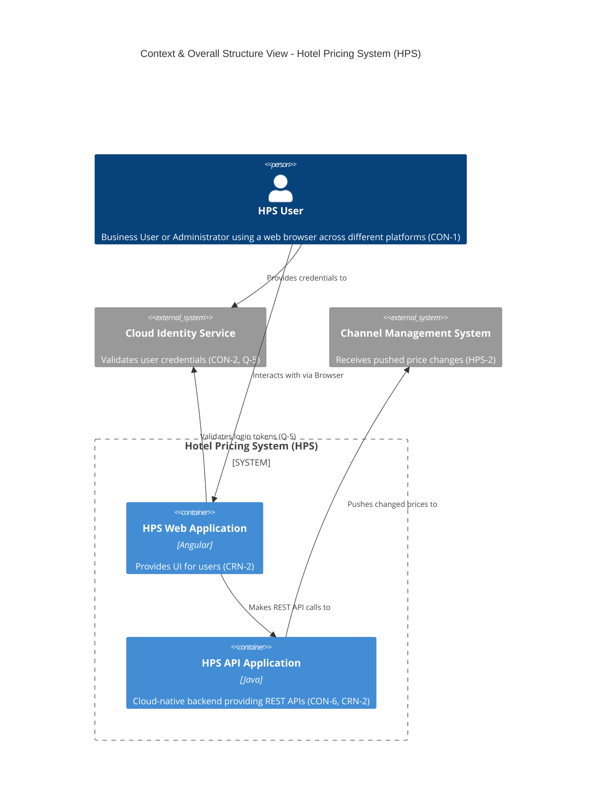

# Software Architecture — Assignment 2: Attribute Driven Design (ADD)

## Hotel Price System (HPS) — Architecture Design Report

| **Course** | Software Architecture |
|---|---|
| **Assignment** | Assignment 2 - Attribute Driven Design |
| **Approach** | Direct LLM interaction |
| **LLM Used** | gemini-3.1-pro-preview |
| **Team Members** | 韩乐妍, 陈奕谷, 成馨 |
| **Date** | 2026-06-10 |

---

## ADD Step 1: Review Inputs (Global)

This is a **greenfield** system in a **mature domain** (hotel price management), replacing an existing legacy system.

### Use Cases (6)

| ID | Name | Description |
|----|------|-------------|
| HPS-1 | Manage Hotel Information | CRUD operations for hotel information |
| HPS-2 | Change Prices | Modify prices (batch or individual) |
| HPS-3 | Query Prices | Query prices by hotel, date, and other criteria |
| HPS-4 | Manage Hotels | CRUD operations for hotel management |
| HPS-5 | Synchronize with External CMS | Data synchronization with external CMS |
| HPS-6 | User Login & Authentication | User authentication and access control |

### Quality Attributes (9)

| ID | Attribute | Scenario | Use Case | Importance |
|----|-----------|----------|----------|------------|
| QA-1 | Performance | Price query response < 100ms (95th percentile) | HPS-3 | High |
| QA-2 | Reliability | 100% price change publication success (max 3 retries) | HPS-2 | High |
| QA-3 | Availability | Query service uptime >= 99.9% | HPS-3 | High |
| QA-4 | Security | Only authenticated users can modify prices | HPS-2, HPS-6 | High |
| QA-5 | Modifiability | New pricing strategy affects < 5 files | HPS-2 | Medium |
| QA-6 | Testability | Price logic testable without DB dependency | HPS-2 | Medium |
| QA-7 | Scalability | Support 10x concurrent query growth | HPS-3 | Medium |
| QA-8 | Interoperability | Compatible with external CMS data formats | HPS-5 | Medium |
| QA-9 | Deployability | Zero-downtime deployments | HPS-3 | Low |

### Architectural Concerns (5)

| ID | Concern |
|----|---------|
| CRN-1 | Multi-channel distribution (Web, Mobile, API) |
| CRN-2 | Team familiar with Java/Angular/Kafka |
| CRN-3 | Parallel team work allocation |
| CRN-4 | Audit logging |
| CRN-5 | Continuous deployment infrastructure |

### Constraints (6)

| ID | Constraint |
|----|------------|
| CON-1 | Cloud deployment |
| CON-2 | Relational database (PostgreSQL) |
| CON-3 | Git platform for version control |
| CON-4 | 6-month delivery, MVP in 2 months |
| CON-5 | External CMS integration |
| CON-6 | Angular frontend |

---

## Iteration 1: Establishing Overall System Structure

*Generated by: 陈奕谷 (Member A)*
*Timestamp: 2026-06-11 08:43:53*

### Step 2: Iteration Goal and Driver Selection

**Iteration Goal:** Establish the overall initial system structure.

**Selected Drivers:**
- **CRN-1:** Establish the overall initial system structure.
- **CRN-2:** Leverage the team's knowledge of Java technologies, Angular framework, and Kafka.
- **CON-1:** Users must interact with the system through web browsers on different platforms.
- **CON-2:** Users are managed through a cloud provider identity service, resources hosted in cloud.
- **CON-6:** The system should be designed with a cloud-native approach as a priority.
- **Q-5 (Security):** User credentials validated through cloud identity service.

**Reasoning:** To establish the initial overall system structure (CRN-1), drivers dictating macroscopic shape, deployment environment, and fundamental interaction points are selected. CON-1, CON-2, CON-6 dictate a cloud-hosted, web-based, cloud-native architecture. CRN-2 constrains technology choices.

### Step 3: Element Selection

**Element Selected:** The Hotel Pricing System (HPS) itself.

**Justification:** Per ADD 3.0 for greenfield development, the only available element to refine at this stage is the system context itself—the entire HPS.

### Step 4: Design Concept Selection

**Alternative 1: Monolithic Web Application**
- *Pros:* Simpler to develop and deploy initially, supports 2-month MVP (CON-4).
- *Cons:* Does not align with cloud-native priority (CON-6), harder to scale (Q-4).

**Alternative 2: Cloud-Native Web Application (SPA + API Backend)**
- *Pros:* Aligns with cloud-native approach (CON-6) and cloud hosting (CON-2). Supports Angular frontend (CRN-2) and Java backend (CRN-2). SPA satisfies cross-platform browser requirement (CON-1). Integrates with cloud identity service (Q-5, CON-2).
- *Cons:* Slightly higher initial deployment complexity.

**Selection:** Alternative 2 (Cloud-Native Web Application).
**Rationale:** CON-6 prioritizes cloud-native approach. Splitting frontend/backend leverages Angular (CRN-2) and satisfies cross-platform constraint (CON-1), while cloud hosting integrates with identity service (CON-2, Q-5).

### Step 5: Architectural Elements Instantiation

| Element Name | Responsibility | Properties |
|---|---|---|
| **HPS Web Application** | Provides UI for users to log in, manage hotels/prices, query/change prices (CON-1) | SPA (Angular - CRN-2), Stateless, runs in browser |
| **HPS API Application** | Exposes REST APIs for Web App and external systems. Core business logic for pricing and hotel management | Cloud-native backend (Java - CRN-2), Stateless, hosted in cloud (CON-2) |
| **Cloud Identity Service** | External service managing users and validating credentials during login (Q-5, CON-2) | External Cloud Service |
| **Channel Management System** | External system receiving pushed price changes (HPS-2) | External System |

**Interfaces:**
- Browser ↔ HPS Web App: HTTP/HTTPS
- HPS Web App ↔ Cloud Identity Service: OAuth/OIDC for login validation
- HPS Web App ↔ HPS API App: REST API over HTTPS (JSON)
- HPS API App ↔ Channel Management System: Network push to external endpoints

### Step 6: Module View (Mermaid)



### Step 7: Analysis and Goal Review

- **CRN-1 (Establish overall structure):** Addressed. Context and primary components established.
- **CRN-2 (Leverage Angular/Java):** Addressed. Web App uses Angular, API uses Java.
- **CON-1 (Browser on multiple platforms):** Addressed. Angular SPA runs in standard browsers.
- **CON-2 & Q-5 (Cloud identity):** Addressed. Cloud Identity Service included.
- **CON-6 (Cloud-native):** Addressed. System split into independent scalable containers.

**Conclusion:** The iteration goal of establishing the overall initial system structure has been successfully achieved. The design is ready for further refinement in the next iteration.

---

## Iteration 2: Identifying Structures for Primary Functionality

*Generated by: 陈奕谷 (Member B)*
*Timestamp: [Pending - awaiting B's delivery]*

<!-- Content to be filled after member B completes iteration 2 -->

---

## Iteration 3: Addressing Reliability and Availability

*Generated by: 陈奕谷 (Member B)*
*Timestamp: [Pending - awaiting B's delivery]*

<!-- Content to be filled after member B completes iteration 3 -->

---

## Iteration 4: Addressing Development and Operations

*Generated by: 成馨*

### Step 2: Iteration Goal and Driver Selection

<!-- Paste from log_iter4.txt -->

### Step 3: Element Selection

<!-- Paste from log_iter4.txt -->

### Step 4: Design Concept Selection

<!-- Paste from log_iter4.txt -->

### Step 5: Architectural Elements Instantiation

| Element Name | Responsibility | Properties |
|---|---|---|
<!-- Fill from log_iter4.txt -->

### Step 6: Development View (Mermaid)

```mermaid
<!-- Paste Mermaid code from log_iter4.txt -->
```

### Step 7: Analysis and Goal Review

<!-- Paste from log_iter4.txt -->

---

## Interaction Cost Analysis

| The way of completing the assignment | The LLM used | Number of Human Interactions (turns) | Token Consumption (K tokens) |
|---|---|---|---|
| Direct LLM interaction | gemini-3.1-pro-preview | 4 | Iter 1: 4.3K |
> Token consumption is calculated by summing `total_tokens` from each iteration's API response. (To be updated after all iterations complete.)

---

## Individual Reflection

### Member A (韩乐妍)

<!-- Write reflection on: script writing challenges, prior knowledge preparation, ensuring model follows steps, Mermaid generation -->

### Member B (陈奕谷)

<!-- Write reflection on: managing iteration dependencies, copying element names between iterations, handling QA-2/QA-3, verifying knowledge references -->

### Member C (成馨)

<!-- Write reflection on: report consistency across 4 iterations, log merging, iteration 4 execution衔接, final review findings -->

---

## Contribution Table

| Name (Chinese) | Contributions |
|---|---|
| 韩乐妍 | Python script development, prior knowledge preparation, Iteration 1 execution, Mermaid diagram generation |
| 陈奕谷 | Iteration 2 and 3 execution, quality attribute handling, log collection |
| 成馨 | Iteration 4 execution, report integration, cost analysis, individual reflection coordination |
